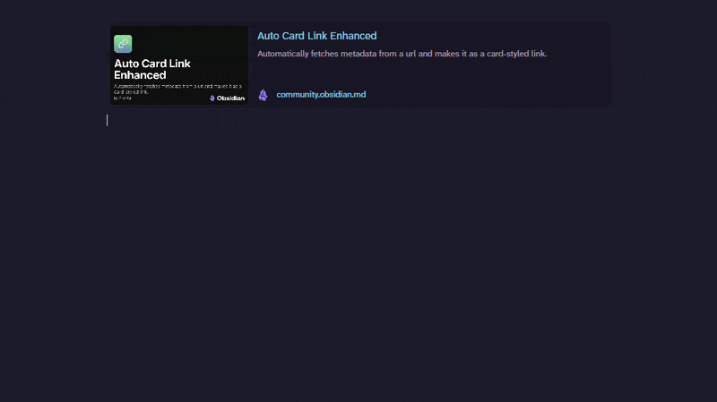

# Auto Card Link Enhanced

- Automatically convert URLs into beautiful <u>card-styled links</u> with metadata, thumbnails and favicons.
- Card-styled links are generated by code block which does not mess up your Markdown files unlike HTML tags!
- Tailored handling for YouTube, Twitch, Reddit, GitHub, Wikipedia, Spotify and more.
- Options for thumbnail quality, saving images locally, and multiple card styles.

<p align="center">
    
</p>

## Features

- Paste a copied URL and enhance it into a card.
- Enhance a selected URL into a card.
- Right-click a card to refresh, delete, or add a line after it.
- Hotkey support for pasting or enhancing a URL into a card.
- Support for local images through internal links (`image: "[[image.png]]"`).

## Settings

- Enhance the default paste action.
- Add the commands to the right-click menu.
- Save images and favicons locally (with configurable folders).
- Choose the card style.
- Show the thumbnail on the left or right of the card.
- Choose thumbnail quality (best looking vs. max resolution).
- Use an external service as a fallback for blocked sites (off by default).

## Network use

This plugin needs internet access to fetch link metadata. To be transparent about what it sends and where:

- **By default**, it fetches metadata **directly from the site you are linking to** (the same request your browser would make to load that page). Nothing is sent to any other third party.
- **Optionally**, if you enable **"Use external service for blocked sites"** in the settings, the plugin will — **only when a direct fetch fails** — send the link's URL to the third-party service [microlink.io](https://microlink.io) to retrieve metadata from sites that block direct access (e.g. Cloudflare-protected pages). This setting is **off by default**, and no data is ever sent to microlink.io unless you turn it on.

> [!IMPORTANT]
> No analytics, telemetry, or personal data are collected by this plugin.

# Cardlink syntax

The code block `cardlink` uses YAML syntax for displaying card-styled link.

## attributes

| name        | required | description                              |
| ----------- | -------- | ---------------------------------------- |
| url         | true     | url to open when you click the link      |
| title       | true     | title of the link                        |
| description | false    | description of the link                  |
| host        | false    | host of the link                         |
| favicon     | false    | favicon of the link                      |
| image       | false    | thumbnail image to show in the card link |
| author      | false    | channel or author (if present)           |
| duration    | false    | duration time for videos                 |

## example

````
```cardlink
url: https://obsidian.md/
title: "Obsidian - Sharpen your thinking"
description: "The free and flexible app for your private thoughts."
host: obsidian.md
favicon: https://obsidian.md/favicon.ico
image: https://obsidian.md/images/banner.png
```
````

# Customizing Style

Card-styled link is styled by [styles.css](./styles.css). To customize, you can try making [CSS snippets](https://help.obsidian.md/How+to/Add+custom+styles#Use+Themes+and+or+CSS+snippets).

For example:

```css
.auto-card-link-author {
	display: none;
}
```

To hide the author.

# Motivation

- Wanted to show beautiful links in my notes
- Didn't want to mess up my notes with HTML tags
- Wanted to keep the original plugin updated (KreNtal)

# Credits

This is a fork of the original obsidian-auto-card-link by Nekoshita Yuki.

[Auto Card Link Enhanced](https://github.com/KreNtal/obsidian-auto-card-link) maintained by [KreNtal](https://github.com/KreNtal) since 2026-05-04.
